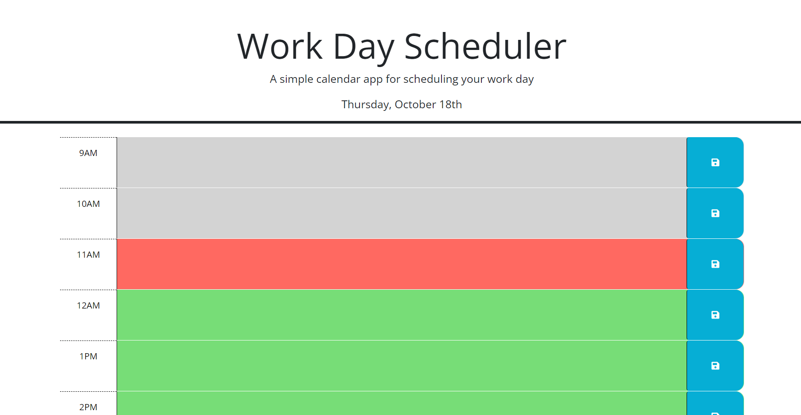

# work-day-scheduler

## Description
This project was designed to help me learn how to use third party APIs. Starting with a base HTML that used Bootstrap for structure with css styling, I coded the functionality of the webpage using JQueries, localStorage, and "date", a built in JavaScript object. I learned how to use the date object to get a live readout of the date and time in different formats, use "this" to delegate events to certain elements, and how to manipulate objects and get certain values to update them.

## Usage
To use this webpage, enter an event into the text area of the time slot. Once the event(s) are entered, click the save button on the right side of the time slot. This will save the event(s) to the localStorage of your browser so that the event(s) do not disappear when the page is refreshed. To remove an event, select and delete the event in the text area, then click the save button.

## Screenshots

## Live Application
The link to the live application of the webpage is: https://coldnebraska.github.io/work-day-scheduler/

## Source Code
The source code is located at the website https://github.com/coldnebraska/work-day-scheduler 
